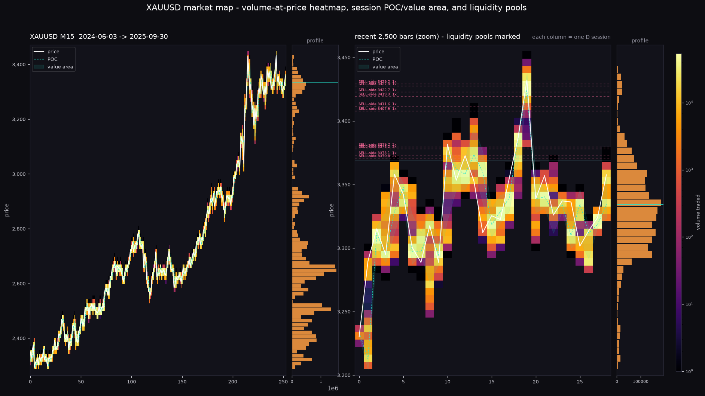
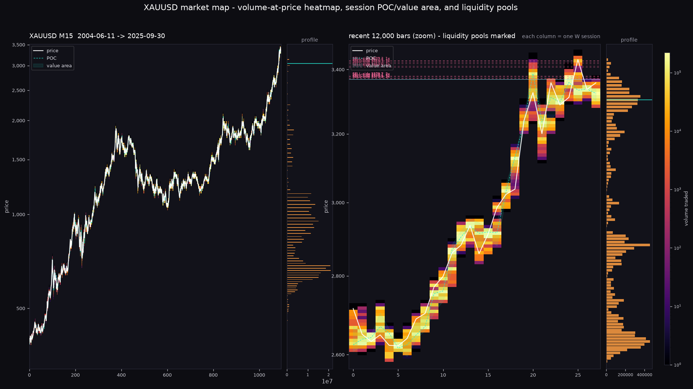

# Market maps: volume profile, liquidity pools, depth — and what they're actually worth



*One year of XAUUSD M15. Each column is a session, colour = volume traded at that price. White = price, dashed cyan = the session's developing POC, translucent band = its 70% value area. Right panel = the volume profile for the window; dashed lines = clustered liquidity pools and untested prior-session extremes.*

---

## 1. What was built

| Module | What it gives you |
|---|---|
| `core/market_map.py` | the library: `volume_profile`, `profile_heatmap`, `liquidity_pools`, `session_extremes`, `round_numbers`, plus live depth recording |
| `tools/market_map_report.py` | renders the picture — from the research parquet **or** live from MT5 |
| `research/map_validation.py` | measures whether each level type beats a distance-matched control |
| `tests/test_market_map.py` | 20 assertions guarding the maths and the grid alignment |

```bash
# a picture from history
python tools/market_map_report.py --parquet research/data/XAUUSD_M15_2004_2025.parquet \
    --freq D --bins 110 --out docs/market_maps/xauusd_daily_1y.png

# or live, from a running MetaTrader 5 terminal
python tools/market_map_report.py --symbol XAUUSD --timeframe M15 --bars 20000 \
    --freq D --out out/live_map.png

# the numbers behind the picture
python research/map_validation.py
```

Everything here imports without MetaTrader5 installed — every live call is behind a function that takes the `mt5` module as an argument, so the research harness and CI can use the same code that runs live.



*21.3 years of weekly volume-at-price, log price scale. You can see gold's 2011-2015 distribution shelf at $1,200-1,900 and where the 2024-2025 revaluation traded.*

---

## 2. Do these levels actually mean anything?

This is the part that matters, and it is why `research/map_validation.py` exists. The picture is a **description of the past**; a trade filter is a **claim about the future**, and the two are not the same thing.

Each test compares the map level against a **distance-matched control** observed in the same session, because "price reacted at the level" is worthless without knowing how often price reacts at *any* level that far away.

| # | Test | n | Map level | Matched control | Verdict |
|---|---|---|---|---|---|
| A | POC reached before an equal move away | 1,928 | **55.6%** | 44.5% | significant — **but see below** |
| A′ | …same, only when **both barriers sit inside** the prior session range | 724 | **49.2%** | 50.8% | **the effect disappears** |
| B | Value-area edge → ≥0.5 ATR move | 2,883 | +0.127R | +0.102R | no |
| C | Swing-high liquidity pool → forward return after first touch | 97,716 | −0.010R | −0.025R | no (P(breakout) = 49.6%) |
| D | Bar range: LVN minus HVN (ATR-normalised) | 31,414 | **+0.262×** | — | **yes, real** |
| E | Round $10 level reached before an equal move away | 5,025 | 49.2% | 50.8% | no |

### Test A is a textbook false positive, and finding it is the point

Taken at face value, "the prior session's POC attracts price, 55.6% vs 44.5%" looks like the strongest result in the file. It is an artifact.

The POC **must** sit inside the prior session's range; the mirror level, being the same distance away on the other side, often does not. So the race is really *"is the POC inside yesterday's range?"* versus *"is the mirror outside it?"* — and price returning into a range it has just left is not a POC effect, it is a range effect.

Restrict the sample to races where **both** barriers are inside yesterday's range and the advantage evaporates: **49.2% vs 50.8%**, i.e. a coin flip. The remaining apparent edge in the unfiltered numbers is entirely the range boundary.

That single control is worth more than the whole picture.

### Test D is where the real signal is

Holding the distance from the POC constant (five distance bands), bars sitting on **low-volume nodes** travel at **1.150×** the previous session's mean bar range, versus **0.901×** for bars on high-volume nodes — a 27% difference in bar range, 95% CI on the difference [+0.239, +0.286] in normalised units.

This is the one mechanism that reproduces the intuition: **price moves faster through prices where little traded, and grinds where a lot traded.** It also survives normalisation, so it is not an artifact of gold's 10× price rise across the sample.

It is however a *microstructure* effect, not a directional signal — it tells you where price will move quickly, not which way. Using it to trade means wider stops in HVN and expectations of fast travel in LVN.

### What this means for the ICT-style reading

* **"Liquidity sweep then reversal" is not supported.** After the first touch of a clustered swing high, price continues through it 49.6% of the time (n = 97,716) — indistinguishable from a coin flip, and the same as a distance-matched random level. There is no "stop hunt then reverse" bias in the data.
* **"POC is a magnet" is not supported** once the range boundary is controlled for.
* **Prior-day/week/month extremes** and **round numbers** show no measurable attraction beyond chance.
* **HVN/LVN travel speed is real** and is the only level-based effect that survives matched controls.

None of that means the picture is useless — traders use profiles for context and risk placement, and "price grinds in HVN" is genuinely useful for deciding where to put a stop. It does mean these levels should not be promoted to *entry signals* on the evidence available.

---

## 3. Using the maps as a filter on the trend system: tested, rejected

Level reactions are one question; whether map context improves an actual trading
system is another. `research/map_filter_test.py` answers the second: it runs the
shipping system (H4 Donchian55 / 2xATR stop / 4xATR trail, long-only) over 21.3
years, annotates every trade with map features computed **only from data before
the entry**, then splits the trades by each feature.

The control that matters is a **permutation null** — shuffle the feature labels
2,000 times and see how large a difference appears by chance when ~270 trades are
split in two.

| Filter | Kept | Expectancy in / out | Difference | p (shuffle) |
|---|---|---|---|---|
| Entry in **HVN** (top third of volume-at-price) | 90 / 267 | +0.438R / +0.194R | +0.244R | 0.35 |
| Entry in **LVN** (bottom third) | 92 / 267 | +0.295R / +0.266R | +0.029R | 0.91 |
| Pool within 0.21 ATR overhead | 134 / 267 | +0.260R / +0.293R | −0.033R | 0.90 |
| Entry above the prior week's value area | 226 / 267 | +0.219R / +0.591R | −0.372R | 0.29 |
| Far from prior session POC | 118 / 267 | +0.131R / +0.392R | −0.261R | 0.29 |
| Near a round $10 level | 133 / 267 | +0.175R / +0.377R | −0.202R | 0.44 |

**Nothing survives** (Bonferroni threshold for eight tests: p < 0.006; smallest
observed p = 0.11).

### Two things worth internalising from this

**1. The first pass lied, and the shuffle test caught it.** With a slightly
different sample (239 trades, 200 shuffles) the same test showed LVN entries at
+0.494R (p = 0.114) and *avoiding* far-from-POC trades at −0.731R (p = 0.015).
Fixing the sample construction and raising the shuffles to 2,000 collapsed both
to +0.029R (p = 0.91) and −0.261R (p = 0.29). Neither was real; both were
artifacts of how the subset was drawn. Any filter you build by slicing history
should be put through the same mill.

**2. Doubling expectancy can still lose money.** Keeping only HVN entries raises
per-trade expectancy from +0.276R to +0.438R — a 59% improvement — and the
account still compounds to **+21% instead of +43%**, because you are taking 90
trades instead of 267. A thin edge is a *rate* as well as a size; cutting
two-thirds of your trades to improve the average is usually a losing trade.

## 4. Honest limitations

1. **This is MT5/CFD data, not CME data.** Volume here is broker tick-volume (the M1 set from HistData carries no volume at all, so those frames fall back to a one-unit-per-bar activity proxy). It is an *activity* map, not a true traded-size map. Real volume requires exchange data.
2. **Volume-at-price is approximated.** Each bar's volume is spread uniformly over its high-low range. On M1/M15 that is close to tick-accurate; on H4 it is a smear.
3. **Test D is a bar-range effect, not a P&L result.** Its spread was measured band-by-band; the CI quoted is a two-sample approximation, not a proper clustered bootstrap. Treat the direction as solid and the exact magnitude as soft.
4. **Test B/C sample sizes differ** because they count touches, and one session has many touches. Overlapping events mean the true CI is wider than shown; the sign is what to trust.
5. **No depth (DOM) validation.** `record_depth_snapshot()` exists and works, but no broker-side order-book history was available to test, and a broker with a thin book would produce a map that is pure noise. If you run it live, `research/` the log before believing it.
6. **Nothing here trades.** The validated system remains `strategies/gold_trend.py`. This module is context and research tooling.

---

## 5. Where this leaves the bot

| Use | Status |
|---|---|
| Volume profile / value area for context and stop placement | ✅ supported, tested |
| HVN/LVN for expectations of travel speed | ✅ supported, measured |
| Liquidity pool map (clustered swing highs/lows) | ✅ supported, **no measured edge as a signal** |
| Live DOM heatmap recording | ✅ code path exists, untested against a real book |
| Using any of these as an entry filter in `main.py` | ❌ **rejected by measurement** — see §3: nothing survives the permutation null |

The HVN/LVN P&L test that §4 used to propose as "the honest next step" has now
been run — it is §3, and it rejected the filter as well. The next honest step is
not another single-feature slice (that path has been walked and it produces
artifacts); it would need either a much larger sample of independent trades or a
genuinely different information source, such as the order-book depth that this
stack cannot currently observe.
